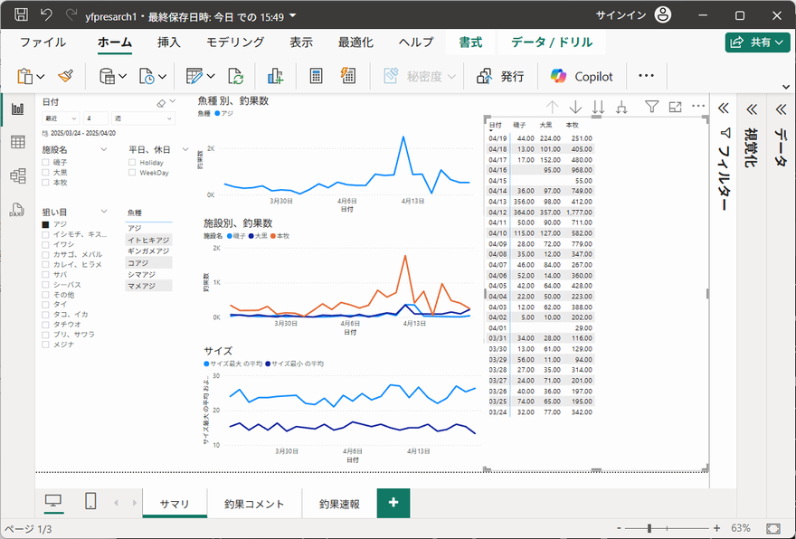
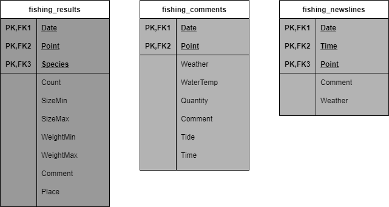

# Fishing Piers Fan

横浜海釣り施設釣行計画のための釣果分析プロジェクト。

横浜フィッシングピアーズホームページから釣果情報を抽出してデータベースを作成します。
データベースを分析することで釣行計画に利用します。

**「魚種別釣果の傾向分析（Power BI）」**



## インストール

Python 3.9 の環境が必要です。

pip install でインストールします。

```
cd {インストール先}/fishing-piers-fan
python -m pip install -e .
```

開発環境なら --force-reinstall を追加してください。

```
python -m pip install --force-reinstall -e .
```

## 使用方法

### 初期ロード

データベースを初期化するには、以下のコマンドを実行します：  

```shell
yfp --init
```

次に、指定した日数より前の釣果データを抽出・ロードするには、以下のように `--day` オプションを使用します（例：過去90日分）：  

```shell
yfp --day 90
```

`--day` オプションを指定しないと、前回実行日以降の新しいデータのみを抽出・ロードします。  

### タスクスケジューラの設定（Windows）

本プロジェクトには、日次で `yfp` コマンドを自動実行するためのスクリプトが含まれています。以下のファイルが `script` ディレクトリにあります：  

- `run_task.bat`

  タスクスケジューラ登録バッチ（毎日6時に実行、PCが6時以降に起動した場合は起動時に実行）

- `run_yfp.bat`

  `yfp` コマンドを起動するバッチ（事前に Python 仮想環境をアクティベート）  

- `run_yfp.vbs`

  バッチ実行時に黒いコマンドプロンプト画面を表示させないためのVBSスクリプト  

⚠ **注意**  

これらのスクリプトには、プロジェクトのパスが `C:\home\python\yfp\fishing-piers-fan` にハードコーディングされています。  
実際のインストールディレクトリに合わせてパスを編集してください。  
パスを修正後、**管理者権限**で `run_task.bat` を実行すると、タスクがスケジュール登録されます。  

> **注意事項**
>
>  横浜フィッシングピアーズの1年分の釣果ページ数は数千ページになります。
--day オプションで長期間のダウンロードをする場合は、
夜間に実行する、巡回インターバルを長くするなど、サイトへの負荷影響を意識して実行してください。

## その場限りの分析(PowerBI)

Miscrosoft 製 PowerBI を用いて釣果データベースの分析を行います。

* セットアップ手順； [PowerBIセットアップ](./docs/setup_powerbi.md)
* 利用手順 ブログ；[横浜フィッシングピアーズ海釣り施設、釣果分析2](https://mon3nr.github.io/blog1/blog/yfpreserch02/)

## 仮説を立てた分析(Python)

釣果分析のブログ記事があります。

* 横浜フィッシングピアーズ海釣り施設、釣果分析; https://mon3nr.github.io/blog1/

このプロジェクトでは、Jupyter Notebook を使って釣果データの分析を行います。VSCode 環境での実行を推奨します。  

### 推奨環境

[Visual Studio Code](https://code.visualstudio.com/)

VSCode 拡張機能:
	- Python（ms-python.python）
	- Jupyter（ms-toolsai.jupyter）

### 🛠 セットアップ手順（簡易版）

- VSCode を起動
- Python & Jupyter 拡張をインストール
- VSCode で `<ホームディレクトリ>/notebook/` を開く
- 任意の `.ipynb` ノートブックを開いて、セルを順に実行
  
※ 必要に応じて `requirements.txt` または `pip install pandas matplotlib seaborn` などで依存パッケージをインストールしてください。  

### 分析用ノートブック一覧
  
以下の Jupyter Notebook ファイルが含まれています：  

| ファイル名 | 内容概要 |
|---|---|
| `aji_analysis.ipynb` | アジ全体の釣果分析 |
| `comment_analysis.ipynb` | 釣果コメントのワード頻出分析 |
| `comment_analysis2.ipynb` | コメント内の感情・傾向分析（改良版） |
| `daikoku_aji_analysis.ipynb` | 大黒埠頭におけるアジの釣果傾向 |
| `daikoku_bizday_analysis.ipynb` | 大黒埠頭の平日・休日別来訪傾向分析 |
| `daikoku_kurodai_analysis.ipynb` | 黒鯛（チヌ）の釣果動向（大黒） |
| `daikoku_vistors_analysis.ipynb` | 来訪者数の推移と傾向分析（大黒） |
| `shiriyake_ika_analysis.ipynb` | シリヤケイカの時期別出現分析 |


## データベースモデル

データベースの主要なテーブルは以下の３つのテーブルとなります。
SQL を用いてこれらテーブルを検索します。

  

各テーブル定義は以下の通りです。

### fishing_results (魚種別釣果)

その日の魚種別釣果を記録します。

* キー : 
    * Date(日付), Point(施設名), Species(魚種)

* カラム : 
    * Count(釣果数), SizeMin(最小cm), SizeMax(最大cm),WeightMin(最小kg), WieghtMax(最大kg), Comment(コメント), Place(場所)

### fishing_comments (釣果サマリ)

その日の釣果コメント、入場者数、水温などのサマリ情報を記録します。

* キー : 
    * Date(日付), Point(施設名)

* カラム : 
    * Weather(天気), WaterTemp(水温℃), Quantity(入場者数), Comment(コメント), Tide(潮), Time(時刻)

### fishing_newslines (釣果記事)

釣果速報のコメントを記録します。

* キー : 
    * Date(日付), Time(時刻), Point(施設名)

* カラム : 
    * Comment(コメント), Weather(天気)

## 注意事項

横浜フィッシングピアーズホームページデータの二次利用について、動画、画像を除くテキスト情報の利用は特に規定はなく、
一般的な常識の範囲内での利用は問題ないとの回答がありました。
ただし、ブログなどに掲載する場合は事前申請が必要になります。詳細は以下URLを参照してください。

https://yokohama-fishingpiers.jp/honmoku/user-guide/?index=3

> 施設内で撮影（写真・動画）を行なう際には、事前に施設に許可申請が必要です。
SNSへ動画や記事を掲載する場合も、同様に事前のお申込みをお願い致します。
また、撮影内容につきましては、当施設のルールとマナーをお守りください。

## Refference

1. [横浜フィッシングピアーズ](http://daikoku.yokohama-fishingpiers.jp/index.php)
2. [自転車散歩、釣り記録](https://mon3nr.github.io/blog1/)

## COPYRIGHT

Copyright 2021-2025, Minoru Furusawa <mon3nr@gmail.com>

## LICENSE

This program is released under [GNU General Public License, version 2](http://www.gnu.org/licenses/gpl-2.0.html) or later.

