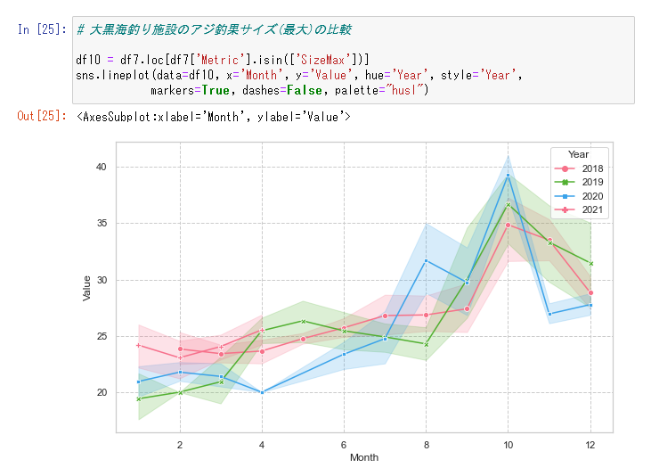

# Yokohama Fishing Piers Fan

横浜フィッシングピアースのホームページから釣果情報を抽出して
データベースにロードします。
定期的に実行することで、データベースに釣果情報を蓄積し、
蓄積したデータベースを分析することで釣行計画に利用します。



以下により詳しい釣果リサーチのブログがあります。

https://mon3nr.github.io/blog1/

## インストール

Python 3.9 の環境が必要です。

* プロジェクトをダウンロードし、pip install でインストールします。

  ```
  cd {インストール先}/fishing-piers-fan
  python -m pip install -e .
  ```

* 開発環境の場合は --force-reinstall を追加します。

  ```
  python -m pip install --force-reinstall -e .
  ```

## 使用方法

* *yfp* コマンドを使用して、データベースを初期化します。

  ```
  yfp --init
  ```

* 釣果データの抽出・ロードを実行します。デフォルトだと、当月のデータを抽出してロードします。

  ```
  yfp
  ```

* --page オプションで直近のページから何ページ目までを巡回するかを指定します。
データベースへのロードは、更新があったデータの差分のみマージしてロードします。

  ```
  yfp --page 10  # 直近の10ページまでを取得して、データベースにマージ
  ```

* --month オプションで何カ月前からのページから巡回するかを指定します。

  ```
  yfp --month 36 # 過去3年分の取得
  ```

  **注意事項**

  横浜フィッシングピアーズの1年分の釣果ページ数は数千ページになります。長い期間を指定してダウンロードを実行する場合は、
  夜間に実行する、巡回インターバルを長くするなど、サイトへの負
  荷が掛からない様に意識して実行してください。

* --show オプションでデータベースのパスなどの構成情報を出力します。

  ```
  yfp --show
  ```

  後述の jupyter notebook でのデータ分析では、本コマンドで表示された 
  fishing_result.db データベースパスを指定します。

  詳細の設定は、 **{project_dir}/data/config.toml** に記述します。

## 分析チュートリアル

**notebook** ディレクトリにサンプルのレポートがあるので、
jupyter notebook で本レポートを開いて実際に利用方法を確認
してください。

* jupyter notebook を起動します。

  ```
  cd {インストール先}/fishing-piers-fan
  jupyter notebook
  ```

  Web ブラウザが起動され、Jupyter notebook のホームページが表示されます。

  **注意事項**

  Linux 環境の場合は、実行ログメッセージに出力された URL を Web ブラウザに入力してアクセスしてください。

* ディレクトリ **notebook** を選択し、サンプルレポート **sample1.ipynb** を選択し、レポートを実行してください。

* Juptyer notebook とのデータ連携は、蓄積した SQLite3 
  データベースのみになります。SQLite3 データベースのパス
  を確認する場合は以下を実行してください。

  ```
  from piersfan.config import Config
  print(Config.get_db_path())
  ```

  表示されたパスを指定して、データベースに接続します

  ```
  conn = sqlite3.connect("{SQLite3データベースパス}")
  ```


* SQL を用いてデータベースを検索します。

  データベースのテーブルモデルは以下の通りです。

    

* 各テーブル定義は以下の通りです。

  * fishing_results (魚種別釣果)
    * キー : Date(日付), Point(施設名), Species(魚種)
    * カラム : Count(釣果数), SizeMin(最小cm), SizeMax
      (最大cm), WeightMin(最小kg), WieghtMax(最大kg), 
      Comment(コメント), Place(場所)
  * fishing_comments (釣果サマリ)
    * キー : Date(日付), Point(施設名)
    * カラム : Weather(天気), WaterTemp(水温℃), 
      Quantity(入場者数), Comment(コメント), Tide(潮), 
      Time(時刻)
  * fishing_newslines (釣果速報)
    * キー : Date(日付), Time(時刻), Point(施設名)
    * カラム : Comment(コメント), Weather(天気)
      
## 注意事項

横浜フィッシングピアーズホームページの二次利用について、
管理事務局より動画、画像を除くテキスト情報の利用は特に
規定はなく、一般的な常識の範囲内での利用は問題ないとの回答
がありました。
ただし、動画、画像に関しては事前の申請が必要になります。
詳細は以下URLを参照してください。

http://daikoku.yokohama-fishingpiers.jp/use.php

> 施設内で撮影（写真・動画）を行なう際には、事前に施設に許可申請が必要です。
SNSへ動画や記事を掲載する場合も、同様に事前のお申込みをお願い致します。
また、撮影内容につきましては、当施設のルールとマナーをお守りください。

## Refference

1. [横浜フィッシングピアーズ](http://daikoku.yokohama-fishingpiers.jp/index.php)
2. [自転車散歩、釣り記録](http://daikoku.yokohama-fishingpiers.jp/index.php)

## COPYRIGHT

Copyright 2021, Minoru Furusawa <frsw3nr@gmail.com>

## LICENSE

This program is released under [GNU General Public License, version 2](http://www.gnu.org/licenses/gpl-2.0.html).

